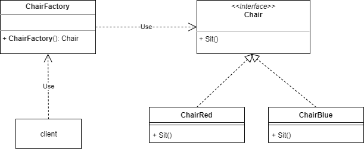
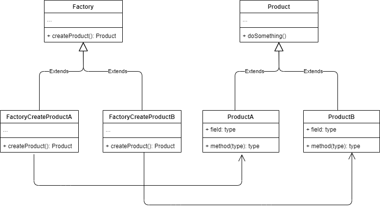

# 001

工厂模式

以制作椅子为例，以client为我方视角，说明工厂模式

## Stone Age

没有工厂的时代，制作什么只能自己动手，需要掌握如何制造椅子（例如下例的`new`）和材料。

```go
// concrete product
type ChairBlue struct {
}

func (c ChairBlue) sit() {
	fmt.Printf("sit in ChairBlue\n")
}

// client
func main() {
	a := new(ChairBlue)
	a.sit()
}
```

## Simple Factory

我已知能坐（有sit方法）的就是椅子

```go
// abstract product
type Chair interface {
	sit()
}
```

有了椅子制造工厂，有两种类型可供你选择，只需要告诉他要红椅子还是绿椅子

```go
// concrete factory
func ChairFactory(style string) Chair {
	switch style {
	case "blue":
		return new(ChairBlue)
	case "red":
		return new(ChairRed)
	}

	return nil
}

// client
func main() {

	a := ChairFactory("blue")
	a.sit()
}
```

简单工厂类图



另外，简单工厂还不在设计模式之列

简单工厂出现了经典的、不满足开闭原则的switch-case逻辑，而这种情况正是[策略模式](../021)要解决的

## Factory Method

将简单工厂的工厂使用策略模式实现，就变成了工厂方法模式。

以格力的空调为例，格力的空调工厂负责生产空调，工厂里的不同车间生产不同型号的空调，目前存在G1和G2两种型号的空调

工厂方法的使用接口延续简单工厂，只是实现方式不同，满足了开闭原则。

如下，给定需要的型号，获得该型号对应的工厂。

```go
getfactory(scheme string)factory
```




工厂方法为每个 Product 的子类提供了一个生产类，在生产 Product 子类比较复杂的情况下使用，创建和使用隔离。如果产品只有一个，就变成了简单工厂模式。

工厂方法可以理解为将车间抽象出来了，多个车间有共同的生产方法`createProduct()`。

到此为止，还是只能生产一类产品，如果想同时生产空调和电视，这个方式就满足不了了。


## reference

1. [简单工厂模式](http://c.biancheng.net/view/8385.html)
2. [工厂方法1](http://c.biancheng.net/view/1348.html)
3. [工厂方法2](https://refactoringguru.cn/design-patterns/factory-method)
4. [UML类图](https://zhuanlan.zhihu.com/p/109655171)

