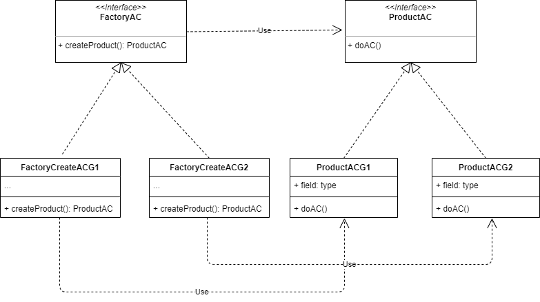

# 001
工厂方法(Factory Method)

工厂方法为每个Product的子类提供了一个生产类，在生产Product子类比较复杂的情况下使用，创建和使用隔离。如果产品只有一个，就变成了简单工厂模式

## reference
- [工厂方法](http://c.biancheng.net/view/1348.html)
- [工厂方法](https://refactoringguru.cn/design-patterns/factory-method)