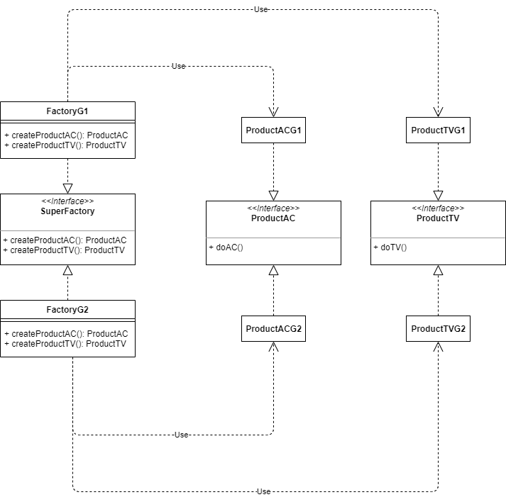

# 002
抽象工厂(Abstract Factory)

[工厂方法](../001)里使用了格力空调的例子，格力借助空调工厂慢慢形成了品牌效应并开发了电视产品，格力的工厂也升级为超级工厂（这里将工厂定格为生产单一产品类，而超级工厂由多个工厂组成，可以生产多个产品类）

抽象工厂可以理解为对工厂的组合，超级工厂虽然可以生产不同产品类，但是每个产品类只有一类产品型号（也即只有一个车间）

抽象工厂模式下，如果要增加超级工厂，是满足开闭原则的，但是要增加工厂（产品类，例如增加烤箱工厂），就不满足开闭原则了。

另外，品类（例如本例的G1）只能针对超级工厂，不能对里面的电视和空调进行控制（G1超级工厂的电视和空调型号只能硬编码写死）

