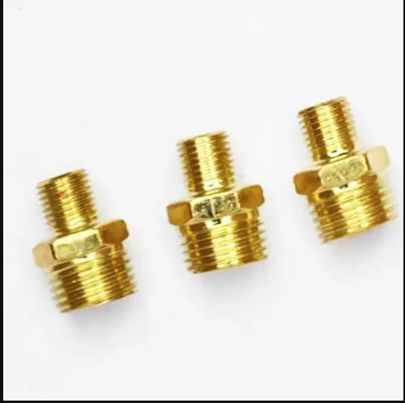
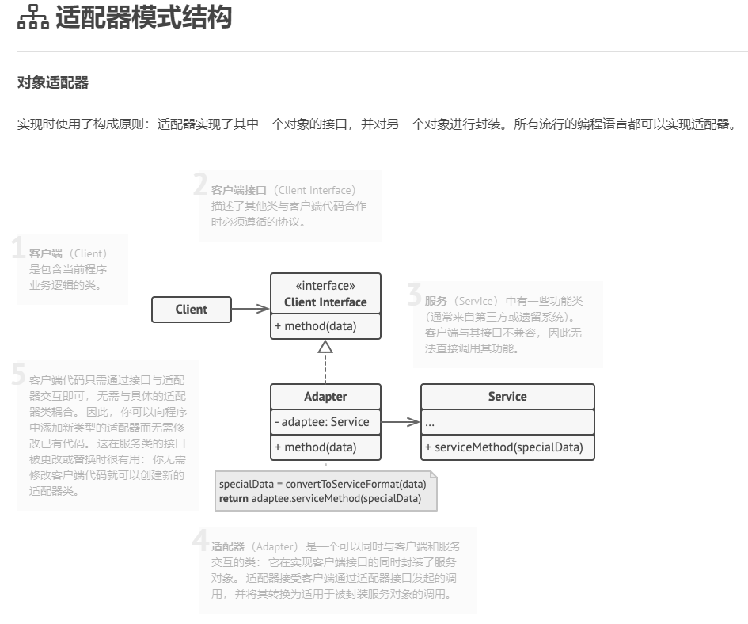
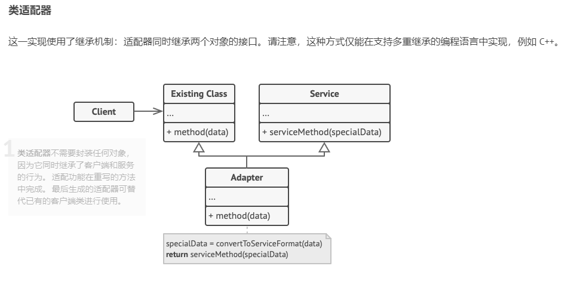

# 006
适配器模式(Adapter Pattern)

相当于一个协调者，比如转接头，输入和输出不匹配，需要转接进行中间调和

代理模式和适配器模式区别
代理模式：在业务和非业务之间建立联系
适配器模式：在业务的定义和实现之间建立联系，常用来通过这种补救措施解决兼容问题（比如旧接口实现新功能）

## reference

1. [适配器模式](https://refactoringguru.cn/design-patterns/adapter)