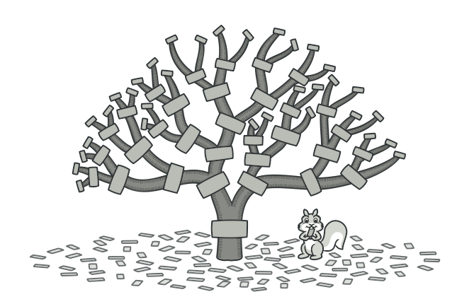
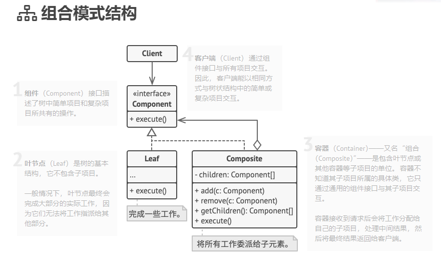

# 008

Composite Pattern

**组合模式**是一种结构型设计模式， 你可以使用它将对象组合成树状结构， 并且能像使用独立对象一样使用它们。

组合模式结构

组合模式有点像面向过程的递归函数，叶节点作为结束递归条件。

## reference

1. [组合模式](https://refactoringguru.cn/design-patterns/composite)
