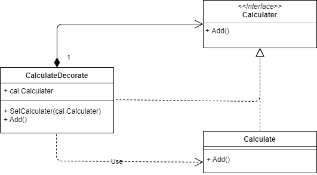
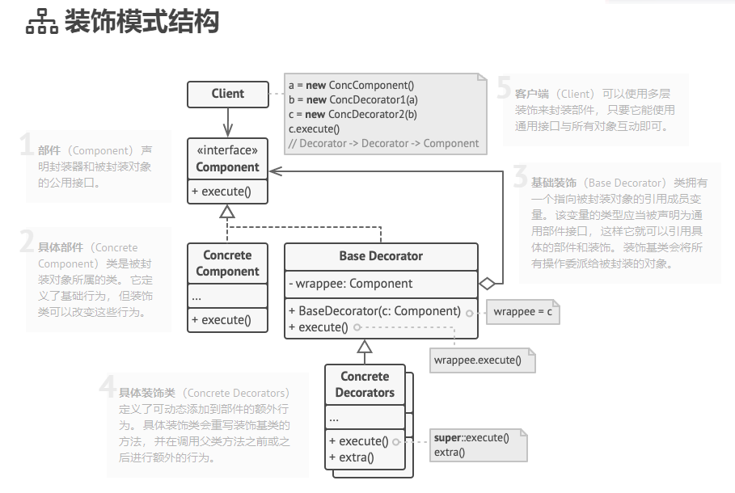
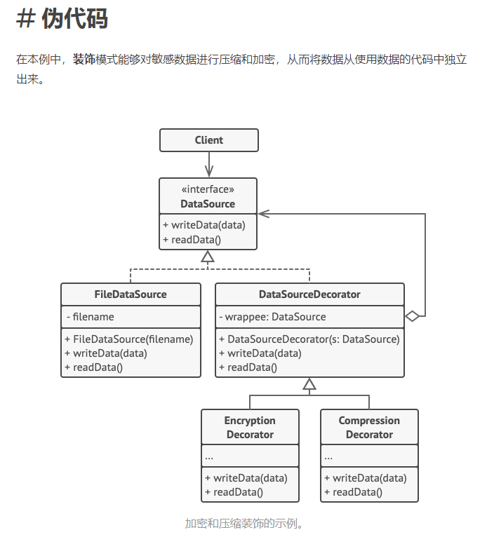

# 009

Decorator Pattern


>  **装饰模式**是一种结构型设计模式， 允许你通过将对象放入包含行为的特殊封装对象中来为原对象绑定新的行为。

>  装饰器（Decorator）模式的定义：指在不改变现有对象结构的情况下，动态地给该对象增加一些职责（即增加其额外功能）的模式

最开始，我有一个计算的类，实现一个加的功能

```go
// 计算类
type Calculate struct {
}

// 加
func (c Calculate) Add() {
	var i int
	i += 1
	time.Sleep(2 * time.Second)
	fmt.Printf("i is %d\n", i)
}
```

然后，我想看看这个加的方法的效率，原始的策略是直接修改这个`Add`方法

```go
func (c Calculate) Add() {
	start := time.Now()

	var i int
	i += 1
	time.Sleep(2 * time.Second)
	fmt.Printf("i is %d\n", i)

	duration := time.Since(start)
	fmt.Printf("cost is %+v ms\n", duration.Milliseconds())

}
```

这样的修改是对已有的方法有侵入性的。

装饰模式的做法是：先把带有这个Add函数的类抽象出来

```go
// 抽象计算类
type Calculater interface {
	Add()
}
```

然后再实现该接口，并对其进行修饰。

```go
// 装饰类
type CalculateDecorate struct {
	cal Calculater
}

func (d *CalculateDecorate) SetCalculater(cal Calculater) {
	d.cal = cal
}
func (d CalculateDecorate) Add() {
	start := time.Now()

	d.cal.Add()

	duration := time.Since(start)
	fmt.Printf("cost is %+v ms\n", duration.Milliseconds())
}
```


装饰模式结构




虽说这种模式不会修改已经存在的Add方法，但是使用这段代码的客户端还是要修改。而python中的装饰器能够做到这两者都不修改，是很好的参考、


- [装饰](https://refactoringguru.cn/design-patterns/decorator)和[代理](https://refactoringguru.cn/design-patterns/proxy)有着相似的结构， 但是其意图却非常不同。 这两个模式的构建都基于组合原则， 也就是说一个对象应该将部分工作委派给另一个对象。 两者之间的不同之处在于*代理*通常自行管理其服务对象的生命周期， 而*装饰*的生成则总是由客户端进行控制。



一个对文件读写添加加密和压缩装饰的伪代码




## reference

1. [装饰器模式](https://refactoringguru.cn/design-patterns/decorator)
2. [装饰器模式2](http://c.biancheng.net/view/1366.html)