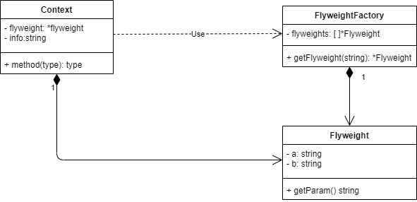
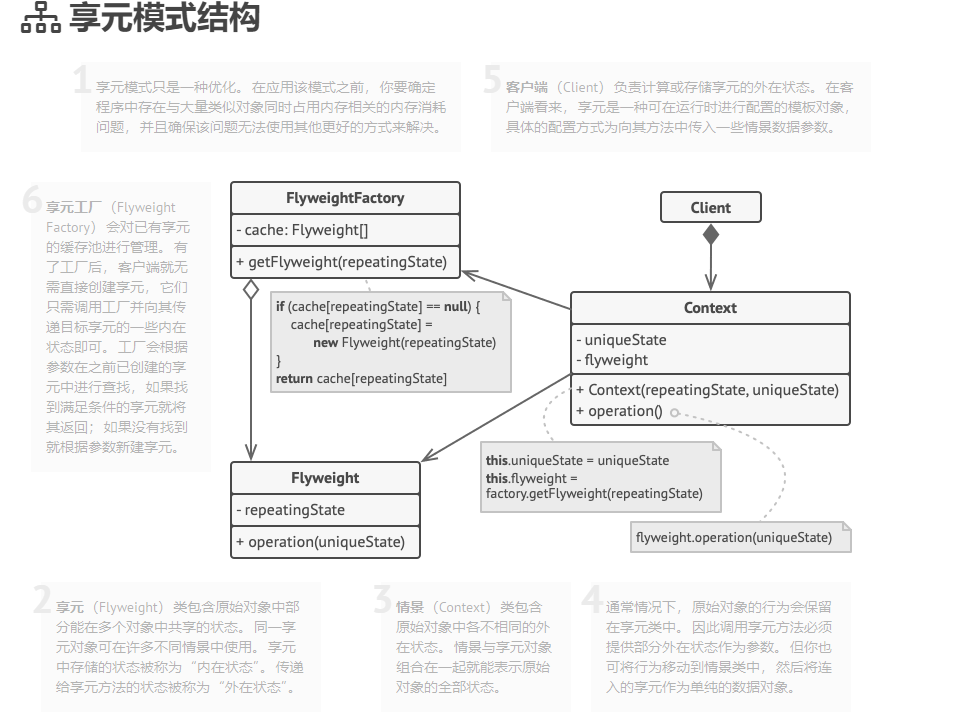
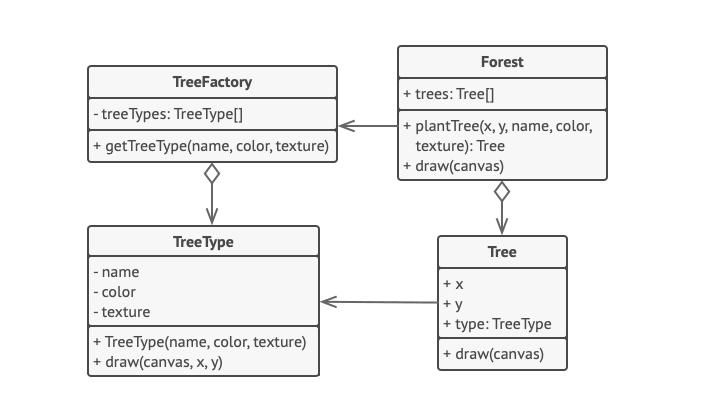

# 011

享元模式(Flyweight Pattern)

享元模式的实质是将部分不变的属性提取出来，只保存一份实体，其它对其的使用均通过连接的方式（指针或接口），不需要占用完整的内存。

以围棋为例，围棋只有黑白两种棋子，在棋盘上，黑棋的一些属性，比如颜色、形状、大小、重量等都是固定的，这些可以提取出来作为享元，而每个棋子在棋盘上的位置才是独立的属性，可以把独立的属性和享元部分组合起来，构成一个完整的对象。

结构

参考里的享元模式结构

## reference

1. [享元模式](https://refactoringguru.cn/design-patterns/flyweight)

