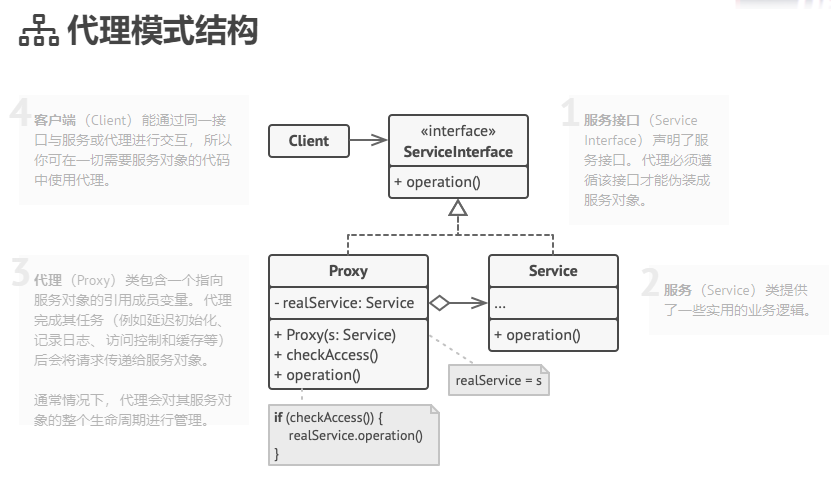

# 012
代理模式（Proxy Pattern）

**代理模式**是一种结构型设计模式， 让你能够提供对象的替代品或其占位符。 代理控制着对于原对象的访问， 并允许在将请求提交给对象前后进行一些处理。

代理模式结构

代理模式区别于其他类似模式的主要特点是代理和被代理对象提供了相同的接口。

适配器模式主要是接口参数适配，比如传进来的是xml数据，要适配成json数据。

- [适配器模式](https://refactoringguru.cn/design-patterns/adapter)能为被封装对象提供不同的接口， [代理模式](https://refactoringguru.cn/design-patterns/proxy)能为对象提供相同的接口， [装饰模式](https://refactoringguru.cn/design-patterns/decorator)则能为对象提供加强的接口。

## reference

1. [代理模式](https://refactoringguru.cn/design-patterns/proxy)