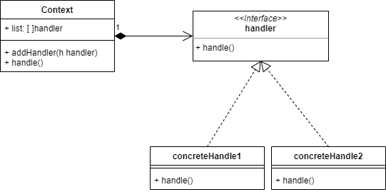
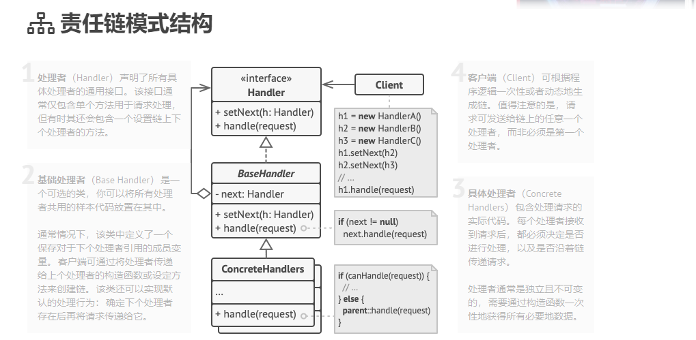

# 013

Chain of Responsibility Pattern

> **责任链模式**是一种行为设计模式， 允许你将请求沿着处理者链进行发送。 收到请求后， 每个处理者均可对请求进行处理， 或将其传递给链上的下个处理者。

使用Context类可以创建不同的责任链，比如A链可以由`1->2->3`组成，B链可以由`1->3`组成。

handler接口的handle()方法需要约定好不同情况的返回值，以便context判断是否继续向下传递。

另一种责任链结构

## reference

1. [责任链](https://www.liaoxuefeng.com/wiki/1252599548343744/1281319474561057)
2. [责任链2](https://refactoringguru.cn/design-patterns/chain-of-responsibility)

