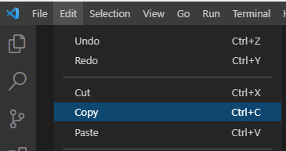
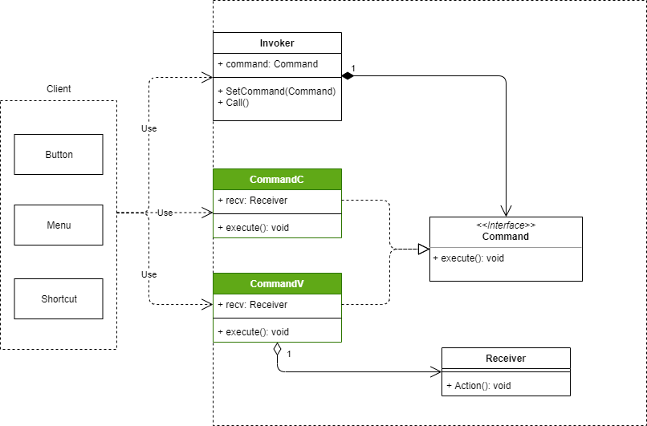
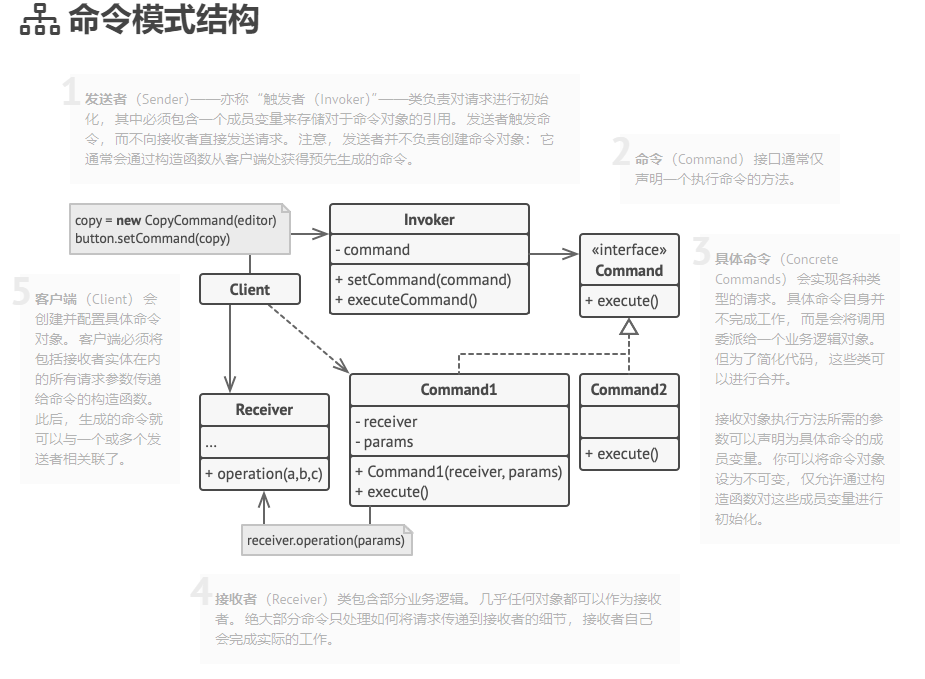

# 014

Command Pattern

> 命令（Command）模式的定义如下：将一个请求封装为一个对象，使发出请求的责任和执行请求的责任分割开。这样两者之间通过命令对象进行沟通，这样方便将命令对象进行储存、传递、调用、增加与管理。

> **命令模式**是一种行为设计模式， 它可将请求转换为一个包含与请求相关的所有信息的独立对象。 该转换让你能根据不同的请求将方法参数化、 延迟请求执行或将其放入队列中， 且能实现可撤销操作。

实质是将命令的请求者（调用者）和命令的执行者（实现者/接收者）分开，降低耦合。

以真实世界的餐厅点餐做类比：餐厅本身实现了命令模式结构的点餐系统，顾客是客户端，他会通过菜单查看有哪些菜品（具体命令），点菜时就创建了一个具体的命令（口味、餐量作为命令的参数），服务员作为命令的请求者，他不负责创建具体的命令对象，只负责记录、转达，后台的厨师作为命令的执行者，进行实际的制作。

以VSCode的复制、粘贴为例，通过代码实现一个命令模式。

复制、粘贴作为具体的命令，以菜单的形式呈现给顾客（客户端），顾客可以通过多种方言（按钮、快捷键）点菜，最终都是同一个菜品。

其结构如下：

[参考2](https://refactoringguru.cn/design-patterns/command)的结构图

## reference

1. [命令模式](http://c.biancheng.net/view/1380.html)

2. [命令模式](https://refactoringguru.cn/design-patterns/command)
