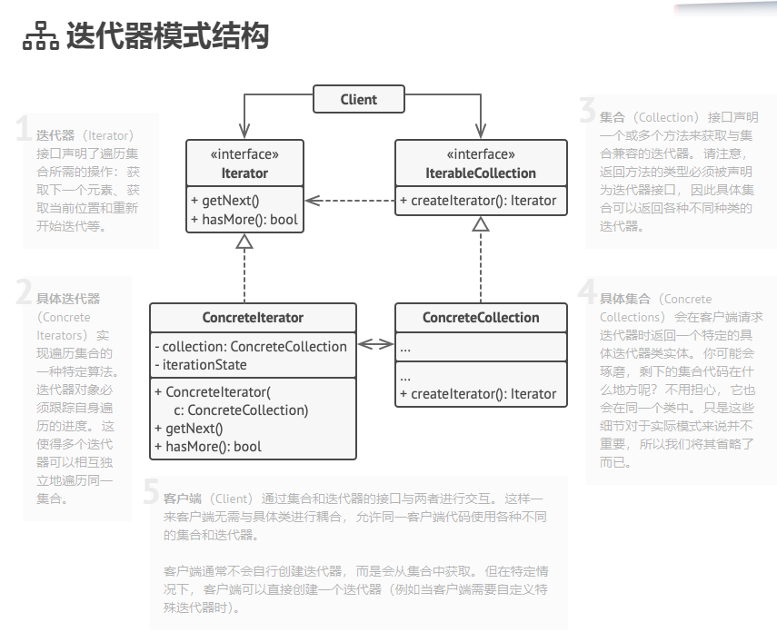

# 016

**迭代器模式**是一种行为设计模式， 让你能在不暴露集合底层表现形式 （列表、 栈和树等） 的情况下遍历集合中所有的元素。

迭代器模式结构

所有的集合都需要能够产生一个迭代器，再通过迭代器对该集合进行遍历。

迭代器必须有两个方法：获取下一个元素，是否还有数据。

每个具体集合可对应多个具体迭代器，具体集合和具体迭代器是相互耦合的，相互使用。

## reference

1.  [迭代器模式](https://refactoringguru.cn/design-patterns/iterator)
