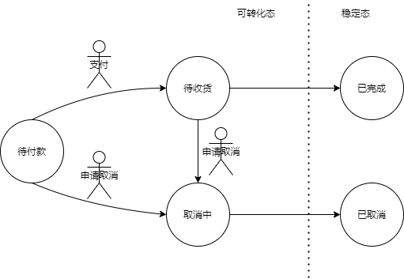
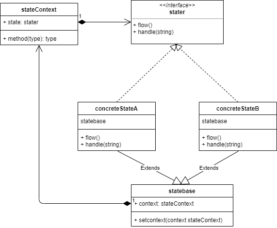

# 020

状态模式（State Pattern）

仿照京东的订单系统，暂未考虑退货等行为，选取如下几种订单状态：

- 待付款

  用户订单提交之后的状态，即订单一旦成立，其状态就是**待付款**，是起始状态。

  - 若无任何操作，15分钟后自动取消订单
  - 主动申请取消，进入**取消中**状态
  - 主动进行支付，进入**待收货**状态

- 待收货

  只由**待付款**状态经过支付行为转化而来，此状态是在快递运输过程中。

  - 若无任何操作，快递到达后变成**已完成**状态
  - 主动申请取消，进入**取消中**状态

- 已完成

  只由**待收货**状态经过接收快递转化而来，目前暂不考虑退货行为，认为此状态为最终状态的一种

- 取消中

  可由**待付款**和**待收货**转化而来

- 已取消

  只能由**取消中**状态转化而来，等待服务人员处理完成即为**已取消**，此状态也是最终状态的一种

  

结构图

