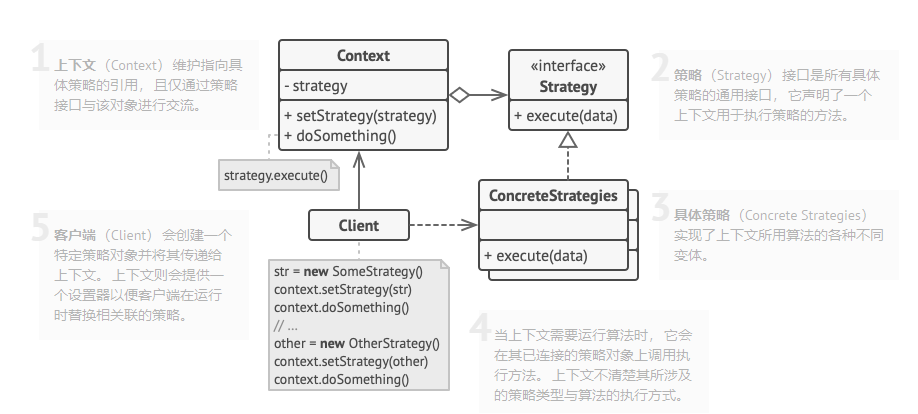

# 021

策略模式(Strategy Pattern)

以购物时选择支付方式的场景为例

```
Order order = 订单信息
if (payType == 微信支付) {
    微信支付流程
} else if (payType == 支付宝) {
    支付宝支付流程
} else if (payType == 银行卡) {
    银行卡支付流程
} else {
    暂不支持的支付方式
}
```

甚至，如果支付模块还支持其他功能，例如查询余额，还要重复一遍上面的判断逻辑

```
Order order = 订单信息
if (payType == 微信支付) {
    微信查询余额流程
} else if (payType == 支付宝) {
    支付宝查询余额流程
} else if (payType == 银行卡) {
    银行卡查询余额流程
} else {
    暂不支持的查询余额方式
}
```

再有其他功能呢？


违反的原则

> 单一职责原则：一个类只有 1 个发生变化的原因
> 之后修改任何逻辑，当前方法都会被修改
>
> 开闭原则：对扩展开放，对修改关闭
> 当我们需要增加、减少某种支付方式(积分支付/组合支付)，或者增加优惠券等功能时，不可避免的要修改该段代码

## 策略模式结构




go实例中省略了Context，直接使用interface代替

## reference

1. [策略模式详解](https://zhuanlan.zhihu.com/p/346607652)
2. [策略模式](https://refactoringguru.cn/design-patterns/strategy)
3. [UML类图](https://zhuanlan.zhihu.com/p/109655171)
