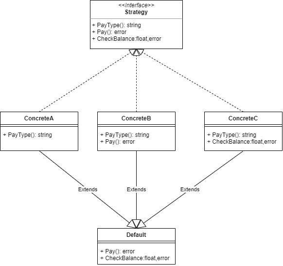

# 021

策略模式(Strategy Pattern)

以购物时选择支付方式的场景为例

```
Order order = 订单信息
if (payType == 微信支付) {
    微信支付流程
} else if (payType == 支付宝) {
    支付宝支付流程
} else if (payType == 银行卡) {
    银行卡支付流程
} else {
    暂不支持的支付方式
}
```

甚至，如果支付模块还支持其他功能，例如查询余额，还要重复一遍上面的判断逻辑

```
Order order = 订单信息
if (payType == 微信支付) {
    微信查询余额流程
} else if (payType == 支付宝) {
    支付宝查询余额流程
} else if (payType == 银行卡) {
    银行卡查询余额流程
} else {
    暂不支持的查询余额方式
}
```

再有其他功能呢？

违反的原则

> 单一职责原则：一个类只有 1 个发生变化的原因
> 之后修改任何逻辑，当前方法都会被修改
>
> 开闭原则：对扩展开放，对修改关闭
> 当我们需要增加、减少某种支付方式(积分支付/组合支付)，或者增加优惠券等功能时，不可避免的要修改该段代码

## 策略模式结构


只需要在初始化的时候，将支持的策略配置好，就可以在各处使用了。

```go
var PaymentSingle strategy.Payment

func PaymentInit() {
	// 初始化
	PaymentSingle.Init()
	PaymentSingle.SetPayment(strategy.PayAlipay, new(strategy.AlipayPayment))
	PaymentSingle.SetPayment(strategy.PayWechat, new(strategy.WechatPayment))
	PaymentSingle.SetPayment(strategy.PayBankCard, new(strategy.BankCardPayment))
}
```

如果需要主程序不感知策略，或策略支持二次开发，（支持已实现的全部），那就需要用到[模块自注册][]功能了

如果需要通过配置文件动态的获取支持的策略，（支持已实现的部分），需要用到[模块自注册][]功能和[工厂方法][]模式

策略模式满足了开闭原则，新增策略只需要实现策略接口实现的函数即可，但是，如果策略接口要增加方法，所有的具体策略都要跟随增加了，这时候就不满足开闭原则了。另外，如果策略接口方法过多，而某些具体策略只支持很少，但是也要实现其他相关接口。解决的办法可以加一个基类（默认操作的类），具体策略可以只修改自己有差异点的方法。

如下图：


策略模式就是适合接口不变，增加策略的场景，如果接口也需要频繁增加，那就不是一个好的策略模式，可以把一部分接口分类，固定成一个接口，做二级策略模式

go 实例中省略了 Context，直接使用 interface 代替，现实场景中，Context 里的`doSomething()`可以包含提取的一些通用操作，只在有差异处执行`execute(data)`

## reference

1. [策略模式详解](https://zhuanlan.zhihu.com/p/346607652)
2. [策略模式](https://refactoringguru.cn/design-patterns/strategy)
3. [UML 类图](https://zhuanlan.zhihu.com/p/109655171)

[模块自注册]: ../../../../go/tree/master/501
[工厂方法]: ../001
