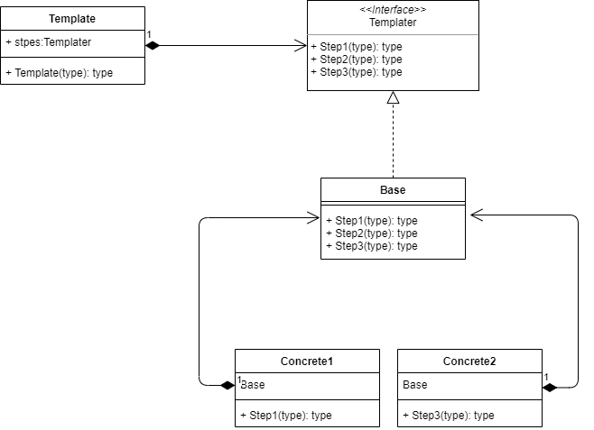

# 022

Template Pattern

>  **模板方法模式**是一种行为设计模式， 它在超类中定义了一个算法的框架， 允许子类在不修改结构的情况下重写算法的特定步骤。

简单来说，其实就是大家长对后代的一种约束，比如，父亲要求孩子的人生大致步骤：上学、工作、结婚、生子。在满足这个大框架的前提下，孩子有一些自由发挥是可以的。

该模式是对继承的一种应用，对支持继承和多态（动态绑定）的语言来说很容易实现，其中各个步骤通过抽象机制在子类中实现，也可以在基类抽象类中实现部分默认操作。

对于没有继承的语言来说，实现起来有些复杂了

