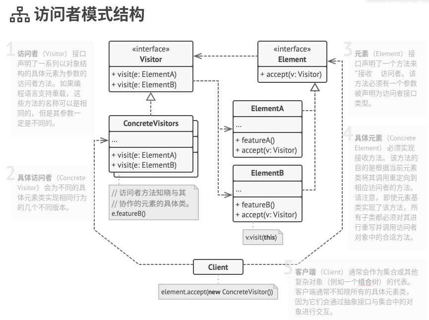
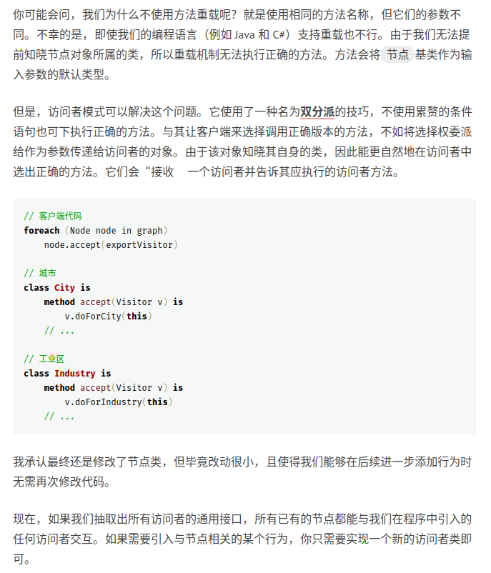

# 023
Visitor Pattern

访问者模式是一种行为设计模式， 它能将算法与其所作用的对象隔离开来。
访问者模式建议将新行为放入一个名为访问者的独立类中， 而不是试图将其整合到已有类中。 现在， 需要执行操作的原始对象将作为参数被传递给访问者中的方法， 让方法能访问对象所包含的一切必要数据。

访问者模式结构

实质上是每个节点添加一个通用方法，执行访问者对于本节点的操作，对于以后的扩展，每个节点不必再做修改，只要切换不同的访问者即可。

## reference

1. [访问者模式](https://refactoringguru.cn/design-patterns/visitor)

